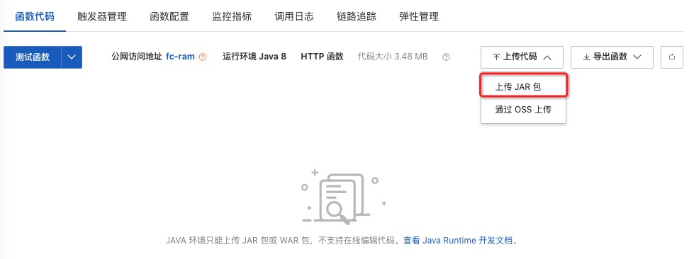
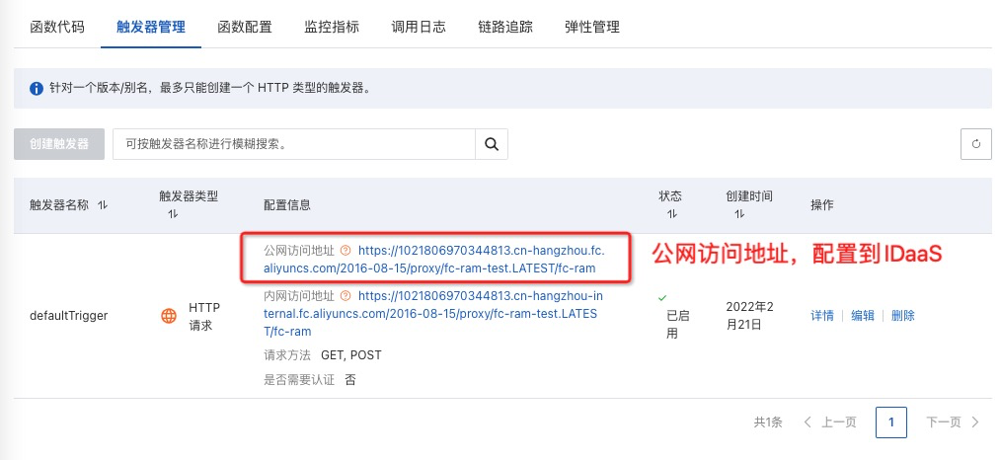
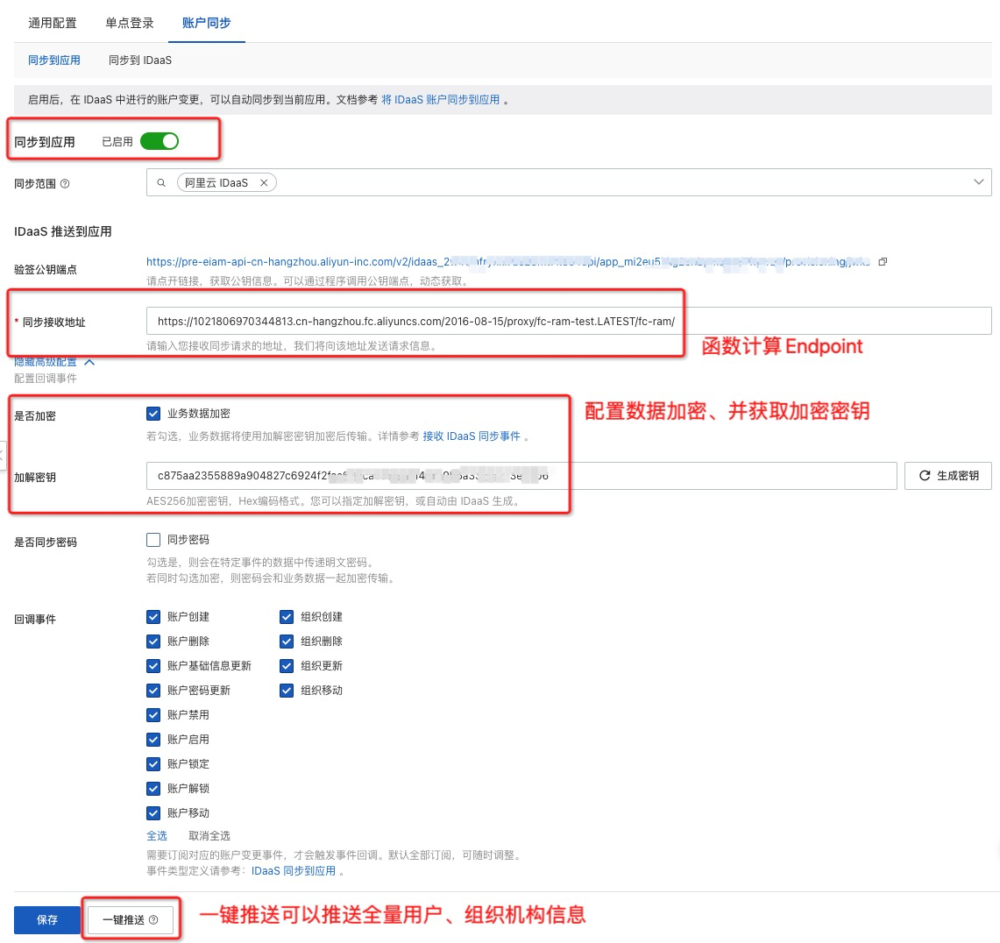
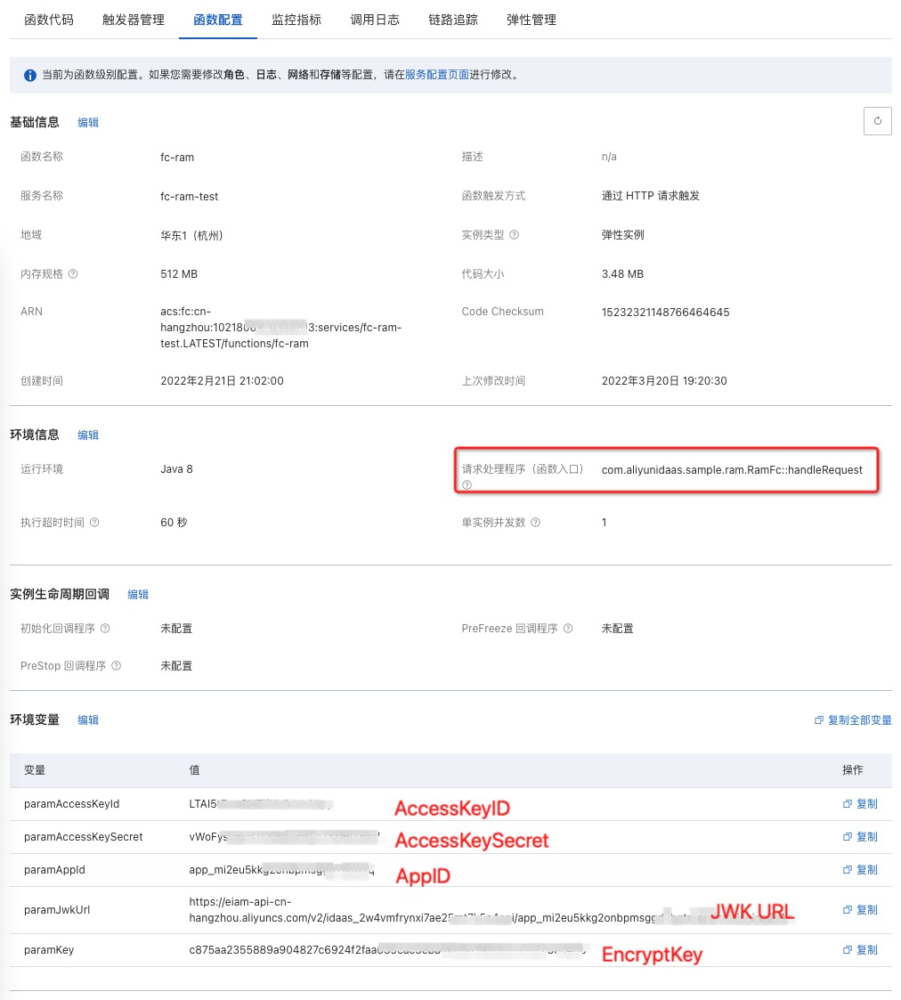
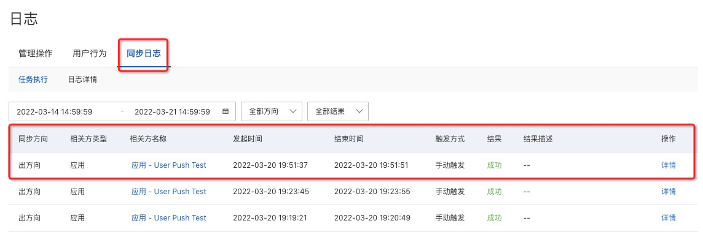
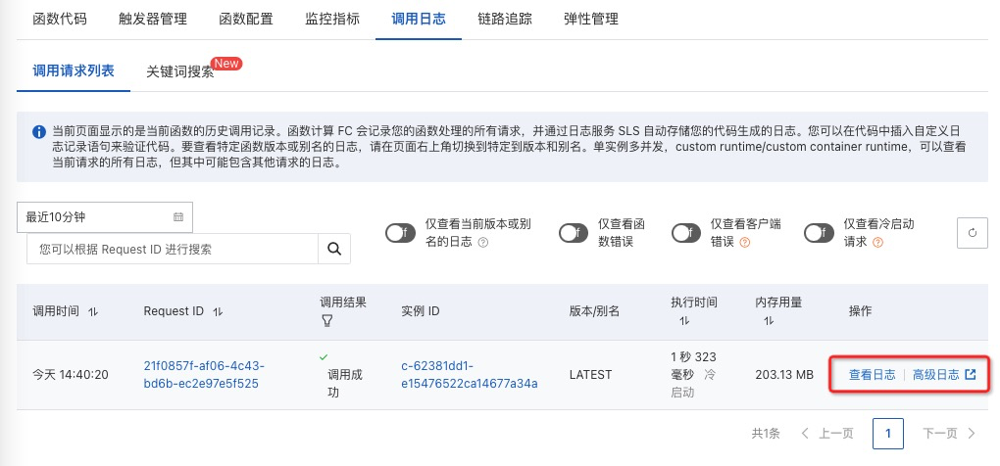

# fc-aliyun-ram-sample

基于阿里云函数计算实现的，从阿里云IDaaS同步到阿里云RAM的Sample应用

> 参考文档：https://help.aliyun.com/document_detail/408976.html

> 代码实现说明：
> 1. 本程序仅用于演示如果实现账号推送同步
> 2. 本程序仅实现账号创建及更新，按 `username` 进行创建或更新，同时未实现账号删除
> 3. 本程序账号处理逻辑并不严谨，比如应当按 `userId` 进行操作，本例中仅按 `username` 进行操作
> 4. 本程序中未对错误进行细分类处理，实际项目中应当细化错误处理逻辑和日志记录
> 5. 本程序仅处理了账号全量推送、新增、更新，未处理状态变更等其他事件
> 6. 本程序未处理用户在该应用的应用账号映射，也就是说配置了应用账号登录时可能遇到用户找不到的问题

Requirements:

* Java 1.8
* Maven 3 *(Tested: Maven 3.5.2)*

编译并打包:

```shell
$ mvn package
```

编译后得到文件：

```shell
$ ll target/
.rw-r--r-- 3.6M * 27 Nov 04:02 java-fc-ram-sample-1.1-SNAPSHOT.jar
```

参数配置清单：

| 参数 | 说明                                                        |
| ---- |-----------------------------------------------------------|
| paramAccessKeyId | 有RAM访问权限的AccessKeyID                                      |
| paramAccessKeySecret | 有RAM访问权限的AccessKeySecret                                  |
| paramAppId | 应用ID                                                      |
| paramJwkUrl | 应用账户同步的"验签公钥端点"                                           |
| paramJwkJson | "验签公钥端点"对应的JWK JSON                                       |
| paramKey | 应用账户同步的"加解密钥"                                             |
| paramAllowedIps | 访问函数的IP地址白名单，支持CIDR表示方法，如 112.124.239.96/27，多个CIDR时逗号隔开即可 |

> paramJwkUrl 和 paramJwkJson 只需要配置其中一项，建议配置 paramJwkJson 减少运行时访问网络依赖

<br>

# 扩展支持其他应用写入

通过实现 EventDataCallback 或通过 DefaultEventDataCallbackImpl 注册事件回调

```java
@Override
protected ResponseObject innerHandleRequest(Context context, RequestObject requestObject) throws Exception {
    final FunctionComputeLogger logger = context.getLogger();
    final IAcsClient client = AliyunClientUtil.createAcsClient();

    final EventDataRunner eventDataRunner = new EventDataRunner();
    eventDataRunner.setEncryptKey(KEY_VALUE);
    eventDataRunner.setJwkUrl(JWK_URL_VALUE);
    eventDataRunner.setAppId(APP_ID_VALUE);
    eventDataRunner.setSimpleLogger(new FcSimpleLogger(context.getLogger()));

    final DefaultEventDataCallbackImpl defaultEventDataCallback = new DefaultEventDataCallbackImpl();
    eventDataRunner.setEventDataCallback(defaultEventDataCallback);
    // 注册用户推送回调
    defaultEventDataCallback.registerUserPushCallback(new UserPushCallback() {
        @Override
        public EventDataResponse onUserPush(EventContext eventContext, UserInfo userInfo) {
            syncUser(client, logger, userInfo);
            return EventDataResponse.newSuccessEventDataResponse();
        }
    });
    // 注册用户增量回调，注意这里只处理了用户创建和更新，根据实际需求可以 Override 需要的函数
    defaultEventDataCallback.registerUserCallback(new UserCallback() {
        @Override
        public EventDataResponse onUserCreate(EventContext eventContext, UserInfo userInfo) {
            syncUser(client, logger, userInfo);
            return EventDataResponse.newSuccessEventDataResponse();
        }

        @Override
        public EventDataResponse onUserUpdateInfo(EventContext eventContext, UserInfo userInfo) {
            syncUser(client, logger, userInfo);
            // 根据实际情况这里返回 SKIPPED, FAILED, NEED_RETRY 不同类型的响应结果
            return EventDataResponse.newSuccessEventDataResponse();
        }
    });

    return eventDataRunner.dispatchEventData(requestObject);
}
```

<br>

# 使用方法

## 一、创建函数，上传编译后的JAR包


## 二、获取函数HTTP入口地址


## 三、配置IDaaS账户同步


## 四、函数配置，配置函数入口及环节变量


## 五、点击一键同步，或创建更新用户后查看推送日志


## 六、在函数计算可以查看运行日志


